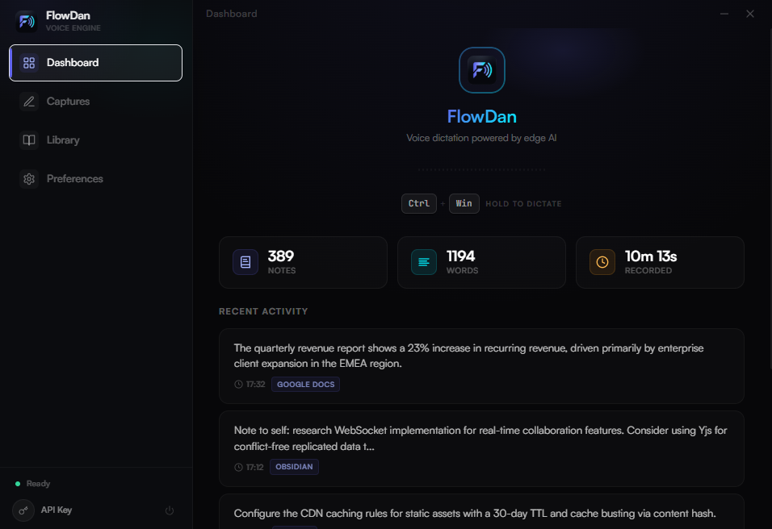
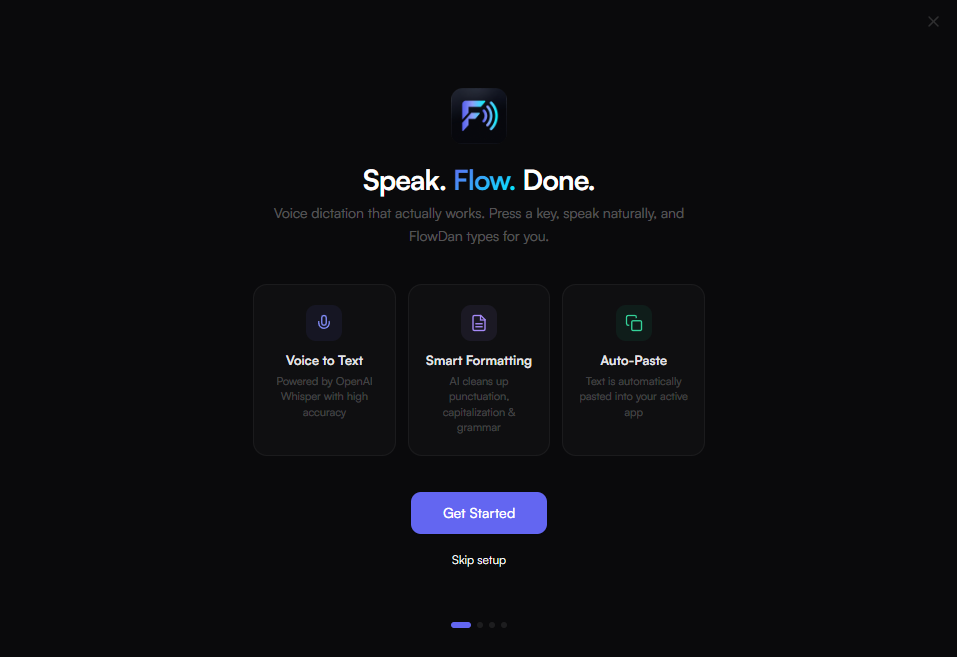
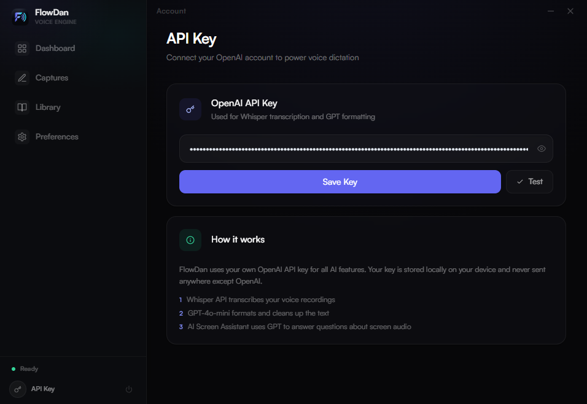
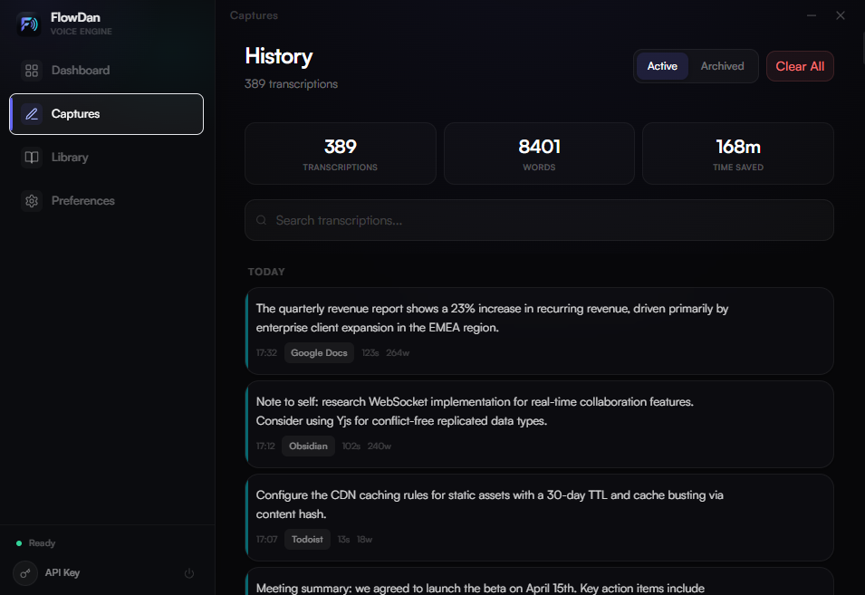

<p align="center">
  
</p>

<h1 align="center">FlowDan</h1>

<p align="center">
  <strong>Voice dictation that actually works.</strong><br>
  Press a key, speak naturally, and FlowDan types for you.
</p>

<p align="center">
  
  
  
  
</p>

<p align="center">
  
</p>

---

## Download

**[Download FlowDan v2.0.0 for Windows](https://github.com/rolleydaniel-ui/flowdan/releases/latest)**

> Just download `FlowDan_2.0.0_x64-setup.exe`, run the installer, and you're ready to go. No coding required.

You'll need an **OpenAI API key** to use FlowDan — [get one here](https://platform.openai.com/api-keys) ($5 credit is enough for months of use).

---

## What is FlowDan?

FlowDan is a lightweight desktop app for **real-time voice dictation**. Hold `Ctrl + Win`, speak, release — your words are transcribed by OpenAI Whisper, formatted by GPT, and instantly pasted into whatever app you're using.

No cloud accounts. No subscriptions. **Bring your own OpenAI API key** and you're good to go.

### Key Features

- **Push-to-Talk** — Hold `Ctrl + Win` to record, release to transcribe
- **AI-Powered Accuracy** — OpenAI Whisper for transcription, GPT-4o-mini for smart formatting
- **Auto-Paste** — Text is automatically pasted into your active window
- **21 Languages** — Polish, English, German, French, Spanish, Japanese, and more
- **Custom Vocabulary** — Teach FlowDan your industry terms and jargon
- **Always-On Overlay** — Draggable floating badge with quick actions
- **System Tray** — Runs quietly in the background with right-click menu
- **History** — Full searchable log of all your dictations
- **Privacy-First** — Your API key stays on your device. Audio is never stored.

## Screenshots

<table>
  <tr>
    <td><br><sub>Setup Wizard</sub></td>
    <td><br><sub>API Key Configuration</sub></td>
  </tr>
  <tr>
    <td><br><sub>Dashboard</sub></td>
    <td><br><sub>Transcription History</sub></td>
  </tr>
</table>

## Quick Start

### Option 1: Download Installer (Recommended)

1. Go to [**Releases**](https://github.com/rolleydaniel-ui/flowdan/releases/latest)
2. Download `FlowDan_2.0.0_x64-setup.exe`
3. Run the installer
4. Launch FlowDan — the setup wizard will guide you

### Option 2: Build from Source

**Prerequisites:** Windows 10/11, [Rust](https://rustup.rs/), [Node.js 18+](https://nodejs.org/)

```bash
git clone https://github.com/rolleydaniel-ui/flowdan.git
cd flowdan/flowdan-tauri
npm install
npx tauri dev       # Development mode
npx tauri build     # Production build
```

The installer will be in `src-tauri/target/release/bundle/nsis/`.

### First Launch

1. FlowDan opens with a **setup wizard**
2. Paste your **OpenAI API key** — [get one here](https://platform.openai.com/api-keys)
3. Choose your **language** and **microphone**
4. Start dictating with **Ctrl + Win**

## How It Works

```
Hold Ctrl+Win  →  Speak  →  Release  →  AI formats  →  Auto-paste
```

1. **Record** — Low-level keyboard hook captures `Ctrl + Win` globally
2. **Transcribe** — Audio sent to OpenAI Whisper API
3. **Format** — GPT-4o-mini cleans up punctuation, grammar, capitalization
4. **Paste** — Text injected into your active window via clipboard

## Tech Stack

| Layer | Technology |
|-------|-----------|
| Framework | [Tauri 2](https://v2.tauri.app/) |
| Frontend | React 18 + TypeScript + Tailwind CSS |
| Backend | Rust |
| Audio | CPAL (cross-platform audio) |
| STT | OpenAI Whisper API |
| Formatting | GPT-4o-mini |
| Database | SQLite (rusqlite) |
| Hotkeys | Windows low-level keyboard hook |
| Build | Vite 6 |

## Data & Privacy

- **API key** stored locally in SQLite database on your device
- **Audio** is sent to OpenAI for transcription and immediately discarded
- **No telemetry**, no analytics, no tracking
- **No cloud account** required
- Data location: `%APPDATA%/com.flowdan.app/`

## API Key Safety

> Your API key is sensitive. Treat it like a password.

- Use a **separate key** for FlowDan — don't reuse keys from other projects
- FlowDan uses minimal credits — **$5 is enough for months** of regular use
- Your key **never leaves your device** except for direct API calls to OpenAI
- You can revoke your key anytime at [platform.openai.com](https://platform.openai.com/api-keys)

## Configuration

All settings are available in the **Preferences** tab:

| Setting | Description |
|---------|------------|
| Language | Transcription language (21 supported) |
| Microphone | Select input device |
| Auto-paste | Automatically paste transcribed text |
| Data folder | Open local storage location |

## Project Structure

```
flowdan-tauri/
├── src/                    # React frontend
│   ├── components/
│   │   ├── dashboard/      # Main app panels
│   │   ├── overlay/        # Floating recording indicator
│   │   └── shared/         # Reusable components
│   ├── styles/             # CSS (Tailwind + custom)
│   └── types/              # TypeScript types & Tauri bindings
├── src-tauri/
│   ├── src/
│   │   ├── ai/             # OpenAI client & prompts
│   │   ├── audio/          # Microphone capture & encoding
│   │   ├── commands/       # Tauri command handlers
│   │   ├── db/             # SQLite models & repos
│   │   └── services/       # Hotkey listener, text injection
│   ├── icons/              # App icons
│   └── tauri.conf.json     # Tauri configuration
└── package.json
```

## Contributing

Contributions are welcome! Feel free to:

- Report bugs via [Issues](https://github.com/rolleydaniel-ui/flowdan/issues)
- Submit pull requests
- Suggest features
- Improve documentation

## License

MIT License — see [LICENSE](LICENSE) for details.

---

<p align="center">
  Built by <a href="https://github.com/rolleydaniel-ui">Daniel Rolley</a>
</p>
